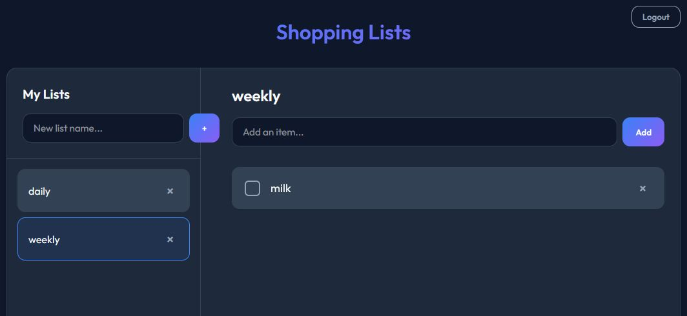

# Sleek Shopping List

A brilliant, fast, and modern serverless shopping list application built specifically for a single admin user. 
This application leverages Firebase for real-time syncing, meaning you can pull it up on your phone at the grocery store while simultaneously updating it on your desktop, and watch the items check off in real time!

## Features

- **Single Admin Lock:** Uses a hardcoded Firestore Database claim (`config/admin`) tied to your initial account creation to ensure that *only you* can ever register, login, read, or manage your shopping lists.
- **Auto-Detect Login Flow:** Bypasses Firebase's "Email Enumeration Protection" with a speculative Soft-Login strategy, creating a seamless 1-click "Login or Setup" experience.
- **Real-time Syncing:** Powered by Firestore snapshot listeners that keep your multiple devices perfectly synchronized.
- **Composite Indexing:** Uses custom Firestore Indexes to beautifully sort list items by creation date.
- **Glassmorphic UI:** Modern, deeply responsive, and extremely sleek CSS design with active pseudo-classes, transitions, and hover effects built natively.

## Tech Stack

- **Frontend:** HTML, Vanilla TypeScript, CSS (Vite setup)
- **Backend:** Firebase Authentication
- **Database:** Firebase Cloud Firestore
- **Hosting:** Firebase Hosting
- **CI/CD:** GitHub Actions (for automatic deployments on Git push)

## Setup & Deployment

Because this app utilizes continuous deployment via GitHub Actions, publishing updates is as easy as pushing code:

1. Write your code updates locally.
2. Commit your changes: `git commit -am "My update"`
3. Push to `main`: `git push`
4. GitHub Actions will automatically kick off `npm run build` and deploy the output to Firebase Hosting!

*(If you ever need to manually deploy, simply run `npm run build && firebase deploy` from the `frontend` folder).*

---
Built with ❤️ by Antigravity
